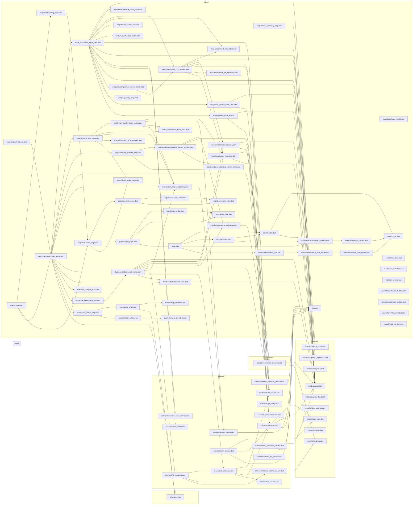

# nutriApp — Vue des dépendances **par dossier**
> Sous-graphes Mermaid pour `ui/`, `state/`, `providers/`, `services/`, `models/` (et `other/`).

## Diagramme


## Stats
```json
{
  "total_files": 88,
  "total_edges": 126,
  "folders": {
    "ui": 1,
    "state": 0,
    "providers": 1,
    "services": 15,
    "models": 9
  },
  "others": 62,
  "rendered_edges": 126
}
```