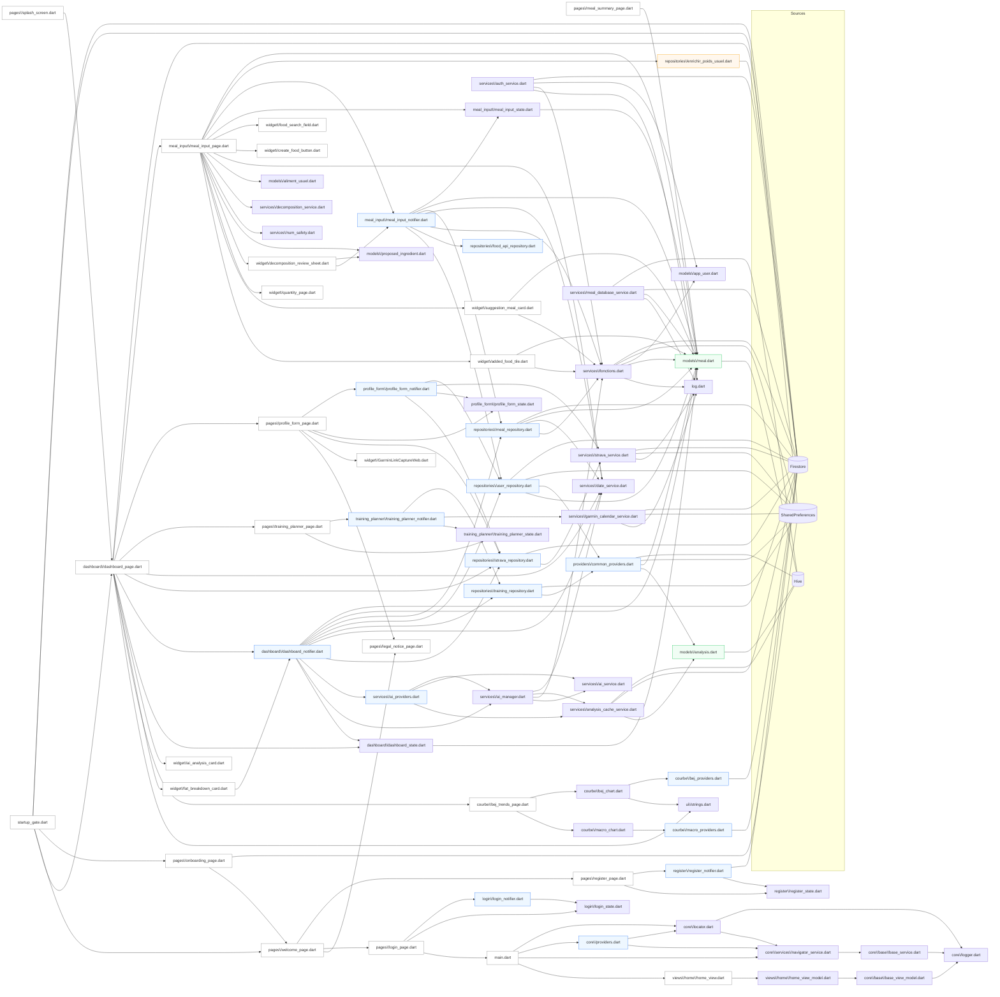
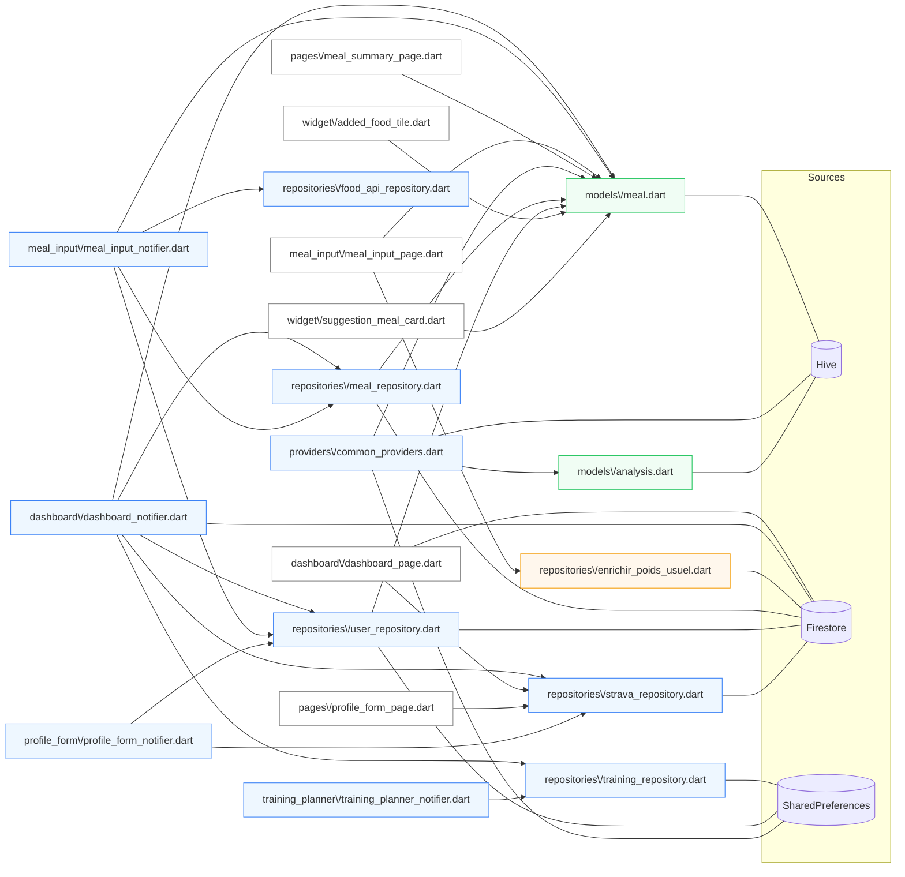
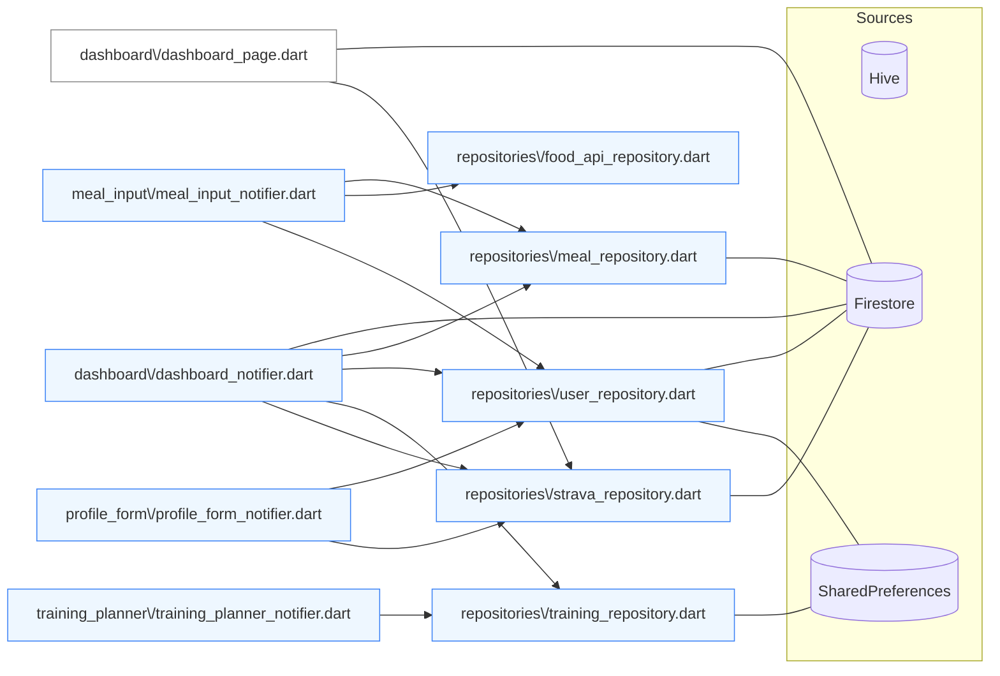
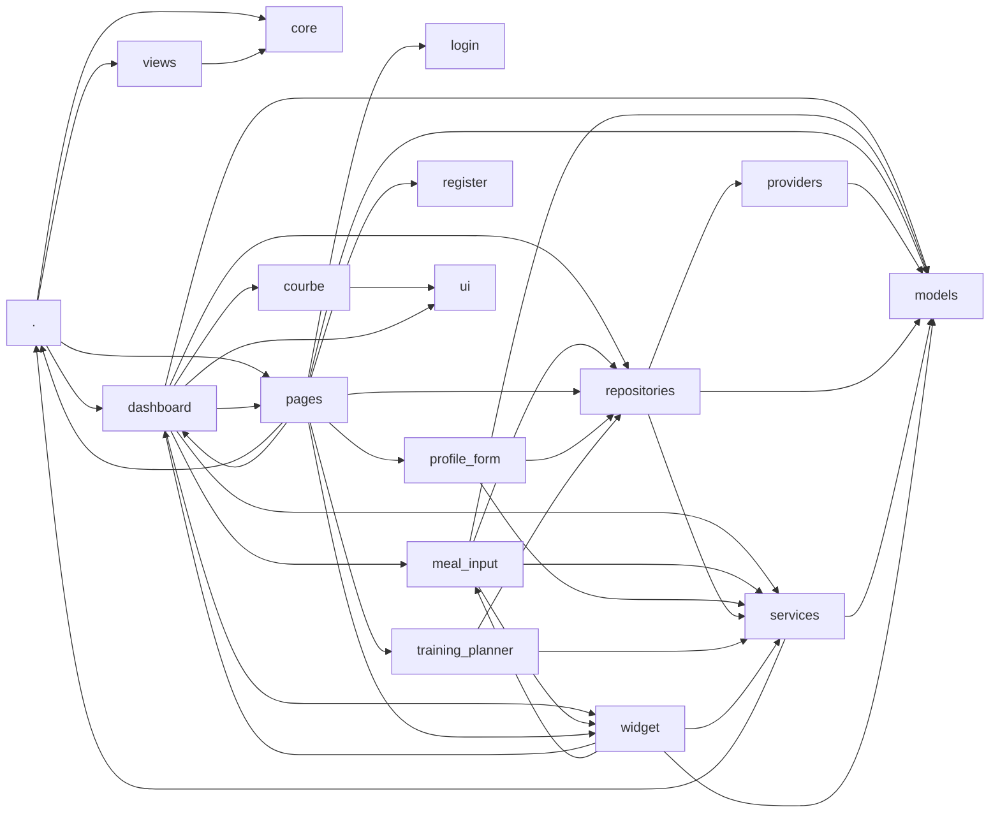

# nutriApp — Carte complète des dépendances (FIXED)
> Basée sur les imports réels dans `lib/` et résolue via `pubspec.yaml`.

## Résumé
```json
{
  "files": 88,
  "imports": 126,
  "pages": 28,
  "providers": 18,
  "notifiers": 6,
  "repositories": 6,
  "models": 2,
  "uses_firestore": 17,
  "uses_hive": 5,
  "uses_prefs": 8
}
```

## 1) Graphe global des imports


## 2) Vue focalisée (Pages/Providers/Notifiers → Repositories/Models)


## 3) Liaisons directes Notifiers/Providers → Repositories


## 4) Dépendances entre dossiers


## 5) Exports JSON (fichiers & imports)
```json
{
  "nodes": {
    "firebase_options.dart": {
      "flags": {
        "notifier": false,
        "repository": false,
        "provider": false,
        "page": false,
        "model": false,
        "uses_firestore": true,
        "uses_hive": false,
        "uses_prefs": false
      },
      "imports": []
    },
    "log.dart": {
      "flags": {
        "notifier": false,
        "repository": false,
        "provider": false,
        "page": false,
        "model": false,
        "uses_firestore": false,
        "uses_hive": false,
        "uses_prefs": false
      },
      "imports": []
    },
    "main.dart": {
      "flags": {
        "notifier": false,
        "repository": false,
        "provider": false,
        "page": true,
        "model": false,
        "uses_firestore": false,
        "uses_hive": false,
        "uses_prefs": false
      },
      "imports": [
        "core/locator.dart",
        "core/providers.dart",
        "core/services/navigator_service.dart",
        "views/home/home_view.dart"
      ]
    },
    "startup_gate.dart": {
      "flags": {
        "notifier": false,
        "repository": false,
        "provider": false,
        "page": true,
        "model": false,
        "uses_firestore": true,
        "uses_hive": false,
        "uses_prefs": true
      },
      "imports": [
        "pages/onboarding_page.dart",
        "pages/welcome_page.dart",
        "dashboard/dashboard_page.dart"
      ]
    },
    "core/locator.dart": {
      "flags": {
        "notifier": false,
        "repository": false,
        "provider": false,
        "page": false,
        "model": false,
        "uses_firestore": false,
        "uses_hive": false,
        "uses_prefs": false
      },
      "imports": [
        "core/logger.dart",
        "core/services/navigator_service.dart"
      ]
    },
    "core/logger.dart": {
      "flags": {
        "notifier": false,
        "repository": false,
        "provider": false,
        "page": false,
        "model": false,
        "uses_firestore": false,
        "uses_hive": false,
        "uses_prefs": false
      },
      "imports": []
    },
    "core/providers.dart": {
      "flags": {
        "notifier": false,
        "repository": false,
        "provider": true,
        "page": false,
        "model": false,
        "uses_firestore": false,
        "uses_hive": false,
        "uses_prefs": false
      },
      "imports": [
        "core/locator.dart",
        "core/services/navigator_service.dart"
      ]
    },
    "core/base/base_model.dart": {
      "flags": {
        "notifier": false,
        "repository": false,
        "provider": false,
        "page": false,
        "model": false,
        "uses_firestore": false,
        "uses_hive": false,
        "uses_prefs": false
      },
      "imports": []
    },
    "core/base/base_service.dart": {
      "flags": {
        "notifier": false,
        "repository": false,
        "provider": false,
        "page": false,
        "model": false,
        "uses_firestore": false,
        "uses_hive": false,
        "uses_prefs": false
      },
      "imports": [
        "core/logger.dart"
      ]
    },
    "core/base/base_view_model.dart": {
      "flags": {
        "notifier": false,
        "repository": false,
        "provider": false,
        "page": false,
        "model": false,
        "uses_firestore": false,
        "uses_hive": false,
        "uses_prefs": false
      },
      "imports": [
        "core/logger.dart"
      ]
    },
    "core/services/navigator_service.dart": {
      "flags": {
        "notifier": false,
        "repository": false,
        "provider": false,
        "page": false,
        "model": false,
        "uses_firestore": false,
        "uses_hive": false,
        "uses_prefs": false
      },
      "imports": [
        "core/base/base_service.dart"
      ]
    },
    "courbe/bej_chart.dart": {
      "flags": {
        "notifier": false,
        "repository": false,
        "provider": false,
        "page": false,
        "model": false,
        "uses_firestore": false,
        "uses_hive": false,
        "uses_prefs": false
      },
      "imports": [
        "courbe/bej_providers.dart",
        "ui/strings.dart"
      ]
    },
    "courbe/bej_providers.dart": {
      "flags": {
        "notifier": false,
        "repository": false,
        "provider": true,
        "page": false,
        "model": false,
        "uses_firestore": true,
        "uses_hive": false,
        "uses_prefs": false
      },
      "imports": []
    },
    "courbe/bej_trends_page.dart": {
      "flags": {
        "notifier": false,
        "repository": false,
        "provider": false,
        "page": true,
        "model": false,
        "uses_firestore": false,
        "uses_hive": false,
        "uses_prefs": false
      },
      "imports": [
        "courbe/bej_chart.dart",
        "courbe/macro_chart.dart"
      ]
    },
    "courbe/macro_chart.dart": {
      "flags": {
        "notifier": false,
        "repository": false,
        "provider": false,
        "page": false,
        "model": false,
        "uses_firestore": false,
        "uses_hive": false,
        "uses_prefs": false
      },
      "imports": [
        "courbe/macro_providers.dart"
      ]
    },
    "courbe/macro_providers.dart": {
      "flags": {
        "notifier": false,
        "repository": false,
        "provider": true,
        "page": false,
        "model": false,
        "uses_firestore": true,
        "uses_hive": false,
        "uses_prefs": false
      },
      "imports": []
    },
    "courbe/sat_char.dart": {
      "flags": {
        "notifier": false,
        "repository": false,
        "provider": false,
        "page": false,
        "model": false,
        "uses_firestore": false,
        "uses_hive": false,
        "uses_prefs": false
      },
      "imports": []
    },
    "courbe/sat_providers.dart": {
      "flags": {
        "notifier": false,
        "repository": false,
        "provider": true,
        "page": false,
        "model": false,
        "uses_firestore": false,
        "uses_hive": false,
        "uses_prefs": false
      },
      "imports": []
    },
    "dashboard/dashboard_notifier.dart": {
      "flags": {
        "notifier": true,
        "repository": false,
        "provider": true,
        "page": false,
        "model": false,
        "uses_firestore": true,
        "uses_hive": false,
        "uses_prefs": false
      },
      "imports": [
        "models/meal.dart",
        "repositories/meal_repository.dart",
        "repositories/user_repository.dart",
        "repositories/training_repository.dart",
        "services/date_service.dart",
        "repositories/strava_repository.dart",
        "services/ai_providers.dart",
        "services/ai_manager.dart",
        "dashboard/dashboard_state.dart"
      ]
    },
    "dashboard/dashboard_page.dart": {
      "flags": {
        "notifier": false,
        "repository": false,
        "provider": true,
        "page": true,
        "model": false,
        "uses_firestore": true,
        "uses_hive": false,
        "uses_prefs": false
      },
      "imports": [
        "meal_input/meal_input_page.dart",
        "pages/profile_form_page.dart",
        "pages/training_planner_page.dart",
        "services/date_service.dart",
        "repositories/strava_repository.dart",
        "dashboard/dashboard_notifier.dart",
        "dashboard/dashboard_state.dart",
        "widget/ai_analysis_card.dart",
        "widget/fat_breakdown_card.dart",
        "courbe/bej_trends_page.dart",
        "ui/strings.dart"
      ]
    },
    "dashboard/dashboard_state.dart": {
      "flags": {
        "notifier": false,
        "repository": false,
        "provider": false,
        "page": false,
        "model": false,
        "uses_firestore": false,
        "uses_hive": false,
        "uses_prefs": false
      },
      "imports": [
        "models/meal.dart"
      ]
    },
    "login/login_notifier.dart": {
      "flags": {
        "notifier": true,
        "repository": false,
        "provider": true,
        "page": false,
        "model": false,
        "uses_firestore": false,
        "uses_hive": false,
        "uses_prefs": false
      },
      "imports": [
        "login/login_state.dart"
      ]
    },
    "login/login_state.dart": {
      "flags": {
        "notifier": false,
        "repository": false,
        "provider": false,
        "page": false,
        "model": false,
        "uses_firestore": false,
        "uses_hive": false,
        "uses_prefs": false
      },
      "imports": []
    },
    "meal_input/meal_input_notifier.dart": {
      "flags": {
        "notifier": true,
        "repository": false,
        "provider": true,
        "page": false,
        "model": false,
        "uses_firestore": false,
        "uses_hive": false,
        "uses_prefs": false
      },
      "imports": [
        "meal_input/meal_input_state.dart",
        "models/meal.dart",
        "repositories/meal_repository.dart",
        "services/date_service.dart",
        "services/fonctions.dart",
        "repositories/food_api_repository.dart",
        "repositories/user_repository.dart"
      ]
    },
    "meal_input/meal_input_page.dart": {
      "flags": {
        "notifier": false,
        "repository": false,
        "provider": false,
        "page": true,
        "model": false,
        "uses_firestore": false,
        "uses_hive": false,
        "uses_prefs": false
      },
      "imports": [
        "models/meal.dart",
        "repositories/enrichir_poids_usuel.dart",
        "meal_input/meal_input_notifier.dart",
        "meal_input/meal_input_state.dart",
        "widget/food_search_field.dart",
        "widget/create_food_button.dart",
        "services/date_service.dart",
        "models/aliment_usuel.dart",
        "services/decomposition_service.dart",
        "services/num_safety.dart",
        "models/proposed_ingredient.dart",
        "widget/decomposition_review_sheet.dart",
        "widget/quantity_page.dart",
        "widget/suggestion_meal_card.dart",
        "widget/added_food_tile.dart"
      ]
    },
    "meal_input/meal_input_state.dart": {
      "flags": {
        "notifier": false,
        "repository": false,
        "provider": false,
        "page": false,
        "model": false,
        "uses_firestore": false,
        "uses_hive": false,
        "uses_prefs": false
      },
      "imports": [
        "models/meal.dart"
      ]
    },
    "models/aliment_usuel.dart": {
      "flags": {
        "notifier": false,
        "repository": false,
        "provider": false,
        "page": false,
        "model": false,
        "uses_firestore": false,
        "uses_hive": false,
        "uses_prefs": false
      },
      "imports": []
    },
    "models/analysis.dart": {
      "flags": {
        "notifier": false,
        "repository": false,
        "provider": false,
        "page": false,
        "model": true,
        "uses_firestore": false,
        "uses_hive": true,
        "uses_prefs": false
      },
      "imports": []
    },
    "models/analysis.g.dart": {
      "flags": {
        "notifier": false,
        "repository": false,
        "provider": false,
        "page": false,
        "model": false,
        "uses_firestore": false,
        "uses_hive": false,
        "uses_prefs": false
      },
      "imports": []
    },
    "models/app_user.dart": {
      "flags": {
        "notifier": false,
        "repository": false,
        "provider": false,
        "page": false,
        "model": false,
        "uses_firestore": false,
        "uses_hive": false,
        "uses_prefs": false
      },
      "imports": []
    },
    "models/custom_food.dart": {
      "flags": {
        "notifier": false,
        "repository": false,
        "provider": false,
        "page": false,
        "model": false,
        "uses_firestore": false,
        "uses_hive": false,
        "uses_prefs": false
      },
      "imports": []
    },
    "models/daily_calories.dart": {
      "flags": {
        "notifier": false,
        "repository": false,
        "provider": false,
        "page": false,
        "model": false,
        "uses_firestore": false,
        "uses_hive": false,
        "uses_prefs": false
      },
      "imports": []
    },
    "models/meal.dart": {
      "flags": {
        "notifier": false,
        "repository": false,
        "provider": false,
        "page": false,
        "model": true,
        "uses_firestore": false,
        "uses_hive": true,
        "uses_prefs": false
      },
      "imports": []
    },
    "models/meal.g.dart": {
      "flags": {
        "notifier": false,
        "repository": false,
        "provider": false,
        "page": false,
        "model": false,
        "uses_firestore": false,
        "uses_hive": false,
        "uses_prefs": false
      },
      "imports": []
    },
    "models/proposed_ingredient.dart": {
      "flags": {
        "notifier": false,
        "repository": false,
        "provider": false,
        "page": false,
        "model": false,
        "uses_firestore": false,
        "uses_hive": false,
        "uses_prefs": false
      },
      "imports": []
    },
    "pages/legal_notice_page.dart": {
      "flags": {
        "notifier": false,
        "repository": false,
        "provider": false,
        "page": true,
        "model": false,
        "uses_firestore": false,
        "uses_hive": false,
        "uses_prefs": false
      },
      "imports": []
    },
    "pages/login_page.dart": {
      "flags": {
        "notifier": false,
        "repository": false,
        "provider": false,
        "page": true,
        "model": false,
        "uses_firestore": false,
        "uses_hive": false,
        "uses_prefs": false
      },
      "imports": [
        "login/login_notifier.dart",
        "login/login_state.dart",
        "main.dart"
      ]
    },
    "pages/meal_summary_page.dart": {
      "flags": {
        "notifier": false,
        "repository": false,
        "provider": false,
        "page": true,
        "model": false,
        "uses_firestore": false,
        "uses_hive": false,
        "uses_prefs": false
      },
      "imports": [
        "models/meal.dart"
      ]
    },
    "pages/onboarding_page.dart": {
      "flags": {
        "notifier": false,
        "repository": false,
        "provider": false,
        "page": true,
        "model": false,
        "uses_firestore": false,
        "uses_hive": false,
        "uses_prefs": true
      },
      "imports": [
        "pages/welcome_page.dart"
      ]
    },
    "pages/profile_form_page.dart": {
      "flags": {
        "notifier": false,
        "repository": false,
        "provider": false,
        "page": true,
        "model": false,
        "uses_firestore": false,
        "uses_hive": false,
        "uses_prefs": false
      },
      "imports": [
        "profile_form/profile_form_notifier.dart",
        "profile_form/profile_form_state.dart",
        "repositories/strava_repository.dart",
        "widget/GarminLinkCaptureWeb.dart",
        "pages/legal_notice_page.dart"
      ]
    },
    "pages/register_page.dart": {
      "flags": {
        "notifier": false,
        "repository": false,
        "provider": false,
        "page": true,
        "model": false,
        "uses_firestore": false,
        "uses_hive": false,
        "uses_prefs": false
      },
      "imports": [
        "register/register_notifier.dart",
        "register/register_state.dart"
      ]
    },
    "pages/splash_screen.dart": {
      "flags": {
        "notifier": false,
        "repository": false,
        "provider": false,
        "page": true,
        "model": false,
        "uses_firestore": false,
        "uses_hive": false,
        "uses_prefs": false
      },
      "imports": [
        "dashboard/dashboard_page.dart"
      ]
    },
    "pages/training_planner_page.dart": {
      "flags": {
        "notifier": false,
        "repository": false,
        "provider": false,
        "page": true,
        "model": false,
        "uses_firestore": false,
        "uses_hive": false,
        "uses_prefs": false
      },
      "imports": [
        "training_planner/training_planner_notifier.dart",
        "training_planner/training_planner_state.dart"
      ]
    },
    "pages/welcome_page.dart": {
      "flags": {
        "notifier": false,
        "repository": false,
        "provider": false,
        "page": true,
        "model": false,
        "uses_firestore": false,
        "uses_hive": false,
        "uses_prefs": false
      },
      "imports": [
        "pages/register_page.dart",
        "pages/login_page.dart",
        "pages/legal_notice_page.dart"
      ]
    },
    "profile_form/profile_form_notifier.dart": {
      "flags": {
        "notifier": true,
        "repository": false,
        "provider": true,
        "page": false,
        "model": false,
        "uses_firestore": false,
        "uses_hive": false,
        "uses_prefs": false
      },
      "imports": [
        "repositories/user_repository.dart",
        "services/strava_service.dart",
        "profile_form/profile_form_state.dart",
        "repositories/strava_repository.dart"
      ]
    },
    "profile_form/profile_form_state.dart": {
      "flags": {
        "notifier": false,
        "repository": false,
        "provider": false,
        "page": false,
        "model": false,
        "uses_firestore": false,
        "uses_hive": false,
        "uses_prefs": false
      },
      "imports": []
    },
    "providers/common_providers.dart": {
      "flags": {
        "notifier": false,
        "repository": false,
        "provider": true,
        "page": false,
        "model": false,
        "uses_firestore": false,
        "uses_hive": true,
        "uses_prefs": true
      },
      "imports": [
        "models/meal.dart",
        "models/analysis.dart"
      ]
    },
    "register/register_notifier.dart": {
      "flags": {
        "notifier": true,
        "repository": false,
        "provider": true,
        "page": false,
        "model": false,
        "uses_firestore": true,
        "uses_hive": false,
        "uses_prefs": false
      },
      "imports": [
        "register/register_state.dart"
      ]
    },
    "register/register_state.dart": {
      "flags": {
        "notifier": false,
        "repository": false,
        "provider": false,
        "page": false,
        "model": false,
        "uses_firestore": false,
        "uses_hive": false,
        "uses_prefs": false
      },
      "imports": []
    },
    "repositories/enrichir_poids_usuel.dart": {
      "flags": {
        "notifier": false,
        "repository": true,
        "provider": false,
        "page": false,
        "model": false,
        "uses_firestore": true,
        "uses_hive": false,
        "uses_prefs": false
      },
      "imports": []
    },
    "repositories/food_api_repository.dart": {
      "flags": {
        "notifier": false,
        "repository": true,
        "provider": true,
        "page": false,
        "model": false,
        "uses_firestore": false,
        "uses_hive": false,
        "uses_prefs": false
      },
      "imports": []
    },
    "repositories/meal_repository.dart": {
      "flags": {
        "notifier": false,
        "repository": true,
        "provider": true,
        "page": false,
        "model": false,
        "uses_firestore": true,
        "uses_hive": false,
        "uses_prefs": false
      },
      "imports": [
        "models/meal.dart",
        "services/date_service.dart",
        "services/fonctions.dart"
      ]
    },
    "repositories/strava_repository.dart": {
      "flags": {
        "notifier": false,
        "repository": true,
        "provider": true,
        "page": false,
        "model": false,
        "uses_firestore": true,
        "uses_hive": false,
        "uses_prefs": false
      },
      "imports": [
        "services/strava_service.dart"
      ]
    },
    "repositories/training_repository.dart": {
      "flags": {
        "notifier": false,
        "repository": true,
        "provider": true,
        "page": false,
        "model": false,
        "uses_firestore": false,
        "uses_hive": false,
        "uses_prefs": true
      },
      "imports": [
        "providers/common_providers.dart"
      ]
    },
    "repositories/user_repository.dart": {
      "flags": {
        "notifier": false,
        "repository": true,
        "provider": true,
        "page": false,
        "model": false,
        "uses_firestore": true,
        "uses_hive": false,
        "uses_prefs": true
      },
      "imports": [
        "providers/common_providers.dart",
        "models/meal.dart"
      ]
    },
    "services/ai_manager.dart": {
      "flags": {
        "notifier": false,
        "repository": false,
        "provider": false,
        "page": false,
        "model": false,
        "uses_firestore": false,
        "uses_hive": false,
        "uses_prefs": false
      },
      "imports": [
        "services/date_service.dart",
        "services/analysis_cache_service.dart",
        "services/fonctions.dart",
        "services/ai_service.dart"
      ]
    },
    "services/ai_providers.dart": {
      "flags": {
        "notifier": false,
        "repository": false,
        "provider": true,
        "page": false,
        "model": false,
        "uses_firestore": false,
        "uses_hive": false,
        "uses_prefs": false
      },
      "imports": [
        "services/ai_manager.dart",
        "services/ai_service.dart",
        "services/analysis_cache_service.dart"
      ]
    },
    "services/ai_service.dart": {
      "flags": {
        "notifier": false,
        "repository": false,
        "provider": false,
        "page": false,
        "model": false,
        "uses_firestore": false,
        "uses_hive": false,
        "uses_prefs": false
      },
      "imports": []
    },
    "services/analysis_cache_service.dart": {
      "flags": {
        "notifier": false,
        "repository": false,
        "provider": false,
        "page": false,
        "model": false,
        "uses_firestore": true,
        "uses_hive": true,
        "uses_prefs": false
      },
      "imports": [
        "models/analysis.dart"
      ]
    },
    "services/api_config.dart": {
      "flags": {
        "notifier": false,
        "repository": false,
        "provider": false,
        "page": false,
        "model": false,
        "uses_firestore": false,
        "uses_hive": false,
        "uses_prefs": false
      },
      "imports": []
    },
    "services/auth_service.dart": {
      "flags": {
        "notifier": false,
        "repository": false,
        "provider": false,
        "page": false,
        "model": false,
        "uses_firestore": true,
        "uses_hive": false,
        "uses_prefs": false
      },
      "imports": [
        "models/app_user.dart",
        "services/fonctions.dart",
        "log.dart"
      ]
    },
    "services/color_extensions.dart": {
      "flags": {
        "notifier": false,
        "repository": false,
        "provider": false,
        "page": false,
        "model": false,
        "uses_firestore": false,
        "uses_hive": false,
        "uses_prefs": false
      },
      "imports": []
    },
    "services/date_service.dart": {
      "flags": {
        "notifier": false,
        "repository": false,
        "provider": false,
        "page": false,
        "model": false,
        "uses_firestore": false,
        "uses_hive": false,
        "uses_prefs": false
      },
      "imports": []
    },
    "services/decomposition_service.dart": {
      "flags": {
        "notifier": false,
        "repository": false,
        "provider": false,
        "page": false,
        "model": false,
        "uses_firestore": false,
        "uses_hive": false,
        "uses_prefs": false
      },
      "imports": []
    },
    "services/fonctions.dart": {
      "flags": {
        "notifier": false,
        "repository": false,
        "provider": false,
        "page": false,
        "model": false,
        "uses_firestore": true,
        "uses_hive": false,
        "uses_prefs": true
      },
      "imports": [
        "models/app_user.dart",
        "models/meal.dart",
        "log.dart"
      ]
    },
    "services/garmin_calendar_service.dart": {
      "flags": {
        "notifier": false,
        "repository": false,
        "provider": false,
        "page": false,
        "model": false,
        "uses_firestore": true,
        "uses_hive": false,
        "uses_prefs": true
      },
      "imports": [
        "log.dart"
      ]
    },
    "services/meal_database_service.dart": {
      "flags": {
        "notifier": false,
        "repository": false,
        "provider": false,
        "page": false,
        "model": false,
        "uses_firestore": true,
        "uses_hive": true,
        "uses_prefs": false
      },
      "imports": [
        "models/meal.dart",
        "log.dart"
      ]
    },
    "services/num_safety.dart": {
      "flags": {
        "notifier": false,
        "repository": false,
        "provider": false,
        "page": false,
        "model": false,
        "uses_firestore": false,
        "uses_hive": false,
        "uses_prefs": false
      },
      "imports": []
    },
    "services/search_api_service.dart": {
      "flags": {
        "notifier": false,
        "repository": false,
        "provider": false,
        "page": false,
        "model": false,
        "uses_firestore": false,
        "uses_hive": false,
        "uses_prefs": false
      },
      "imports": []
    },
    "services/strava_service.dart": {
      "flags": {
        "notifier": false,
        "repository": false,
        "provider": false,
        "page": false,
        "model": false,
        "uses_firestore": true,
        "uses_hive": false,
        "uses_prefs": true
      },
      "imports": [
        "log.dart"
      ]
    },
    "training_planner/training_planner_notifier.dart": {
      "flags": {
        "notifier": true,
        "repository": false,
        "provider": true,
        "page": false,
        "model": false,
        "uses_firestore": false,
        "uses_hive": false,
        "uses_prefs": false
      },
      "imports": [
        "repositories/training_repository.dart",
        "services/garmin_calendar_service.dart",
        "training_planner/training_planner_state.dart"
      ]
    },
    "training_planner/training_planner_state.dart": {
      "flags": {
        "notifier": false,
        "repository": false,
        "provider": false,
        "page": false,
        "model": false,
        "uses_firestore": false,
        "uses_hive": false,
        "uses_prefs": false
      },
      "imports": []
    },
    "ui/strings.dart": {
      "flags": {
        "notifier": false,
        "repository": false,
        "provider": false,
        "page": false,
        "model": false,
        "uses_firestore": false,
        "uses_hive": false,
        "uses_prefs": false
      },
      "imports": []
    },
    "views/home/home_desktop.dart": {
      "flags": {
        "notifier": false,
        "repository": false,
        "provider": false,
        "page": true,
        "model": false,
        "uses_firestore": false,
        "uses_hive": false,
        "uses_prefs": false
      },
      "imports": []
    },
    "views/home/home_mobile.dart": {
      "flags": {
        "notifier": false,
        "repository": false,
        "provider": false,
        "page": true,
        "model": false,
        "uses_firestore": false,
        "uses_hive": false,
        "uses_prefs": false
      },
      "imports": []
    },
    "views/home/home_tablet.dart": {
      "flags": {
        "notifier": false,
        "repository": false,
        "provider": false,
        "page": true,
        "model": false,
        "uses_firestore": false,
        "uses_hive": false,
        "uses_prefs": false
      },
      "imports": []
    },
    "views/home/home_view.dart": {
      "flags": {
        "notifier": false,
        "repository": false,
        "provider": false,
        "page": true,
        "model": false,
        "uses_firestore": false,
        "uses_hive": false,
        "uses_prefs": false
      },
      "imports": [
        "views/home/home_view_model.dart"
      ]
    },
    "views/home/home_view_model.dart": {
      "flags": {
        "notifier": false,
        "repository": false,
        "provider": false,
        "page": false,
        "model": false,
        "uses_firestore": false,
        "uses_hive": false,
        "uses_prefs": false
      },
      "imports": [
        "core/base/base_view_model.dart"
      ]
    },
    "widget/added_food_tile.dart": {
      "flags": {
        "notifier": false,
        "repository": false,
        "provider": false,
        "page": true,
        "model": false,
        "uses_firestore": false,
        "uses_hive": false,
        "uses_prefs": false
      },
      "imports": [
        "models/meal.dart",
        "services/fonctions.dart"
      ]
    },
    "widget/ai_analysis_card.dart": {
      "flags": {
        "notifier": false,
        "repository": false,
        "provider": false,
        "page": true,
        "model": false,
        "uses_firestore": false,
        "uses_hive": false,
        "uses_prefs": false
      },
      "imports": []
    },
    "widget/create_food_button.dart": {
      "flags": {
        "notifier": false,
        "repository": false,
        "provider": false,
        "page": true,
        "model": false,
        "uses_firestore": false,
        "uses_hive": false,
        "uses_prefs": false
      },
      "imports": []
    },
    "widget/decomposition_review_sheet.dart": {
      "flags": {
        "notifier": false,
        "repository": false,
        "provider": false,
        "page": true,
        "model": false,
        "uses_firestore": false,
        "uses_hive": false,
        "uses_prefs": false
      },
      "imports": [
        "models/proposed_ingredient.dart",
        "meal_input/meal_input_notifier.dart"
      ]
    },
    "widget/fat_breakdown_card.dart": {
      "flags": {
        "notifier": false,
        "repository": false,
        "provider": false,
        "page": true,
        "model": false,
        "uses_firestore": false,
        "uses_hive": false,
        "uses_prefs": false
      },
      "imports": [
        "dashboard/dashboard_notifier.dart"
      ]
    },
    "widget/food_list_item.dart": {
      "flags": {
        "notifier": false,
        "repository": false,
        "provider": false,
        "page": true,
        "model": false,
        "uses_firestore": false,
        "uses_hive": false,
        "uses_prefs": false
      },
      "imports": []
    },
    "widget/food_search_field.dart": {
      "flags": {
        "notifier": false,
        "repository": false,
        "provider": false,
        "page": true,
        "model": false,
        "uses_firestore": false,
        "uses_hive": false,
        "uses_prefs": false
      },
      "imports": []
    },
    "widget/GarminLinkCaptureWeb.dart": {
      "flags": {
        "notifier": false,
        "repository": false,
        "provider": false,
        "page": true,
        "model": false,
        "uses_firestore": false,
        "uses_hive": false,
        "uses_prefs": false
      },
      "imports": []
    },
    "widget/quantity_page.dart": {
      "flags": {
        "notifier": false,
        "repository": false,
        "provider": false,
        "page": true,
        "model": false,
        "uses_firestore": false,
        "uses_hive": false,
        "uses_prefs": false
      },
      "imports": []
    },
    "widget/suggestion_meal_card.dart": {
      "flags": {
        "notifier": false,
        "repository": false,
        "provider": false,
        "page": true,
        "model": false,
        "uses_firestore": false,
        "uses_hive": false,
        "uses_prefs": false
      },
      "imports": [
        "models/meal.dart",
        "services/fonctions.dart"
      ]
    }
  },
  "edges": [
    [
      "main.dart",
      "core/locator.dart"
    ],
    [
      "main.dart",
      "core/providers.dart"
    ],
    [
      "main.dart",
      "core/services/navigator_service.dart"
    ],
    [
      "main.dart",
      "views/home/home_view.dart"
    ],
    [
      "startup_gate.dart",
      "pages/onboarding_page.dart"
    ],
    [
      "startup_gate.dart",
      "pages/welcome_page.dart"
    ],
    [
      "startup_gate.dart",
      "dashboard/dashboard_page.dart"
    ],
    [
      "core/locator.dart",
      "core/logger.dart"
    ],
    [
      "core/locator.dart",
      "core/services/navigator_service.dart"
    ],
    [
      "core/providers.dart",
      "core/locator.dart"
    ],
    [
      "core/providers.dart",
      "core/services/navigator_service.dart"
    ],
    [
      "core/base/base_service.dart",
      "core/logger.dart"
    ],
    [
      "core/base/base_view_model.dart",
      "core/logger.dart"
    ],
    [
      "core/services/navigator_service.dart",
      "core/base/base_service.dart"
    ],
    [
      "courbe/bej_chart.dart",
      "courbe/bej_providers.dart"
    ],
    [
      "courbe/bej_chart.dart",
      "ui/strings.dart"
    ],
    [
      "courbe/bej_trends_page.dart",
      "courbe/bej_chart.dart"
    ],
    [
      "courbe/bej_trends_page.dart",
      "courbe/macro_chart.dart"
    ],
    [
      "courbe/macro_chart.dart",
      "courbe/macro_providers.dart"
    ],
    [
      "dashboard/dashboard_notifier.dart",
      "models/meal.dart"
    ],
    [
      "dashboard/dashboard_notifier.dart",
      "repositories/meal_repository.dart"
    ],
    [
      "dashboard/dashboard_notifier.dart",
      "repositories/user_repository.dart"
    ],
    [
      "dashboard/dashboard_notifier.dart",
      "repositories/training_repository.dart"
    ],
    [
      "dashboard/dashboard_notifier.dart",
      "services/date_service.dart"
    ],
    [
      "dashboard/dashboard_notifier.dart",
      "repositories/strava_repository.dart"
    ],
    [
      "dashboard/dashboard_notifier.dart",
      "services/ai_providers.dart"
    ],
    [
      "dashboard/dashboard_notifier.dart",
      "services/ai_manager.dart"
    ],
    [
      "dashboard/dashboard_notifier.dart",
      "dashboard/dashboard_state.dart"
    ],
    [
      "dashboard/dashboard_page.dart",
      "meal_input/meal_input_page.dart"
    ],
    [
      "dashboard/dashboard_page.dart",
      "pages/profile_form_page.dart"
    ],
    [
      "dashboard/dashboard_page.dart",
      "pages/training_planner_page.dart"
    ],
    [
      "dashboard/dashboard_page.dart",
      "services/date_service.dart"
    ],
    [
      "dashboard/dashboard_page.dart",
      "repositories/strava_repository.dart"
    ],
    [
      "dashboard/dashboard_page.dart",
      "dashboard/dashboard_notifier.dart"
    ],
    [
      "dashboard/dashboard_page.dart",
      "dashboard/dashboard_state.dart"
    ],
    [
      "dashboard/dashboard_page.dart",
      "widget/ai_analysis_card.dart"
    ],
    [
      "dashboard/dashboard_page.dart",
      "widget/fat_breakdown_card.dart"
    ],
    [
      "dashboard/dashboard_page.dart",
      "courbe/bej_trends_page.dart"
    ],
    [
      "dashboard/dashboard_page.dart",
      "ui/strings.dart"
    ],
    [
      "dashboard/dashboard_state.dart",
      "models/meal.dart"
    ],
    [
      "login/login_notifier.dart",
      "login/login_state.dart"
    ],
    [
      "meal_input/meal_input_notifier.dart",
      "meal_input/meal_input_state.dart"
    ],
    [
      "meal_input/meal_input_notifier.dart",
      "models/meal.dart"
    ],
    [
      "meal_input/meal_input_notifier.dart",
      "repositories/meal_repository.dart"
    ],
    [
      "meal_input/meal_input_notifier.dart",
      "services/date_service.dart"
    ],
    [
      "meal_input/meal_input_notifier.dart",
      "services/fonctions.dart"
    ],
    [
      "meal_input/meal_input_notifier.dart",
      "repositories/food_api_repository.dart"
    ],
    [
      "meal_input/meal_input_notifier.dart",
      "repositories/user_repository.dart"
    ],
    [
      "meal_input/meal_input_page.dart",
      "models/meal.dart"
    ],
    [
      "meal_input/meal_input_page.dart",
      "repositories/enrichir_poids_usuel.dart"
    ],
    [
      "meal_input/meal_input_page.dart",
      "meal_input/meal_input_notifier.dart"
    ],
    [
      "meal_input/meal_input_page.dart",
      "meal_input/meal_input_state.dart"
    ],
    [
      "meal_input/meal_input_page.dart",
      "widget/food_search_field.dart"
    ],
    [
      "meal_input/meal_input_page.dart",
      "widget/create_food_button.dart"
    ],
    [
      "meal_input/meal_input_page.dart",
      "services/date_service.dart"
    ],
    [
      "meal_input/meal_input_page.dart",
      "models/aliment_usuel.dart"
    ],
    [
      "meal_input/meal_input_page.dart",
      "services/decomposition_service.dart"
    ],
    [
      "meal_input/meal_input_page.dart",
      "services/num_safety.dart"
    ],
    [
      "meal_input/meal_input_page.dart",
      "models/proposed_ingredient.dart"
    ],
    [
      "meal_input/meal_input_page.dart",
      "widget/decomposition_review_sheet.dart"
    ],
    [
      "meal_input/meal_input_page.dart",
      "widget/quantity_page.dart"
    ],
    [
      "meal_input/meal_input_page.dart",
      "widget/suggestion_meal_card.dart"
    ],
    [
      "meal_input/meal_input_page.dart",
      "widget/added_food_tile.dart"
    ],
    [
      "meal_input/meal_input_state.dart",
      "models/meal.dart"
    ],
    [
      "pages/login_page.dart",
      "login/login_notifier.dart"
    ],
    [
      "pages/login_page.dart",
      "login/login_state.dart"
    ],
    [
      "pages/login_page.dart",
      "main.dart"
    ],
    [
      "pages/meal_summary_page.dart",
      "models/meal.dart"
    ],
    [
      "pages/onboarding_page.dart",
      "pages/welcome_page.dart"
    ],
    [
      "pages/profile_form_page.dart",
      "profile_form/profile_form_notifier.dart"
    ],
    [
      "pages/profile_form_page.dart",
      "profile_form/profile_form_state.dart"
    ],
    [
      "pages/profile_form_page.dart",
      "repositories/strava_repository.dart"
    ],
    [
      "pages/profile_form_page.dart",
      "widget/GarminLinkCaptureWeb.dart"
    ],
    [
      "pages/profile_form_page.dart",
      "pages/legal_notice_page.dart"
    ],
    [
      "pages/register_page.dart",
      "register/register_notifier.dart"
    ],
    [
      "pages/register_page.dart",
      "register/register_state.dart"
    ],
    [
      "pages/splash_screen.dart",
      "dashboard/dashboard_page.dart"
    ],
    [
      "pages/training_planner_page.dart",
      "training_planner/training_planner_notifier.dart"
    ],
    [
      "pages/training_planner_page.dart",
      "training_planner/training_planner_state.dart"
    ],
    [
      "pages/welcome_page.dart",
      "pages/register_page.dart"
    ],
    [
      "pages/welcome_page.dart",
      "pages/login_page.dart"
    ],
    [
      "pages/welcome_page.dart",
      "pages/legal_notice_page.dart"
    ],
    [
      "profile_form/profile_form_notifier.dart",
      "repositories/user_repository.dart"
    ],
    [
      "profile_form/profile_form_notifier.dart",
      "services/strava_service.dart"
    ],
    [
      "profile_form/profile_form_notifier.dart",
      "profile_form/profile_form_state.dart"
    ],
    [
      "profile_form/profile_form_notifier.dart",
      "repositories/strava_repository.dart"
    ],
    [
      "providers/common_providers.dart",
      "models/meal.dart"
    ],
    [
      "providers/common_providers.dart",
      "models/analysis.dart"
    ],
    [
      "register/register_notifier.dart",
      "register/register_state.dart"
    ],
    [
      "repositories/meal_repository.dart",
      "models/meal.dart"
    ],
    [
      "repositories/meal_repository.dart",
      "services/date_service.dart"
    ],
    [
      "repositories/meal_repository.dart",
      "services/fonctions.dart"
    ],
    [
      "repositories/strava_repository.dart",
      "services/strava_service.dart"
    ],
    [
      "repositories/training_repository.dart",
      "providers/common_providers.dart"
    ],
    [
      "repositories/user_repository.dart",
      "providers/common_providers.dart"
    ],
    [
      "repositories/user_repository.dart",
      "models/meal.dart"
    ],
    [
      "services/ai_manager.dart",
      "services/date_service.dart"
    ],
    [
      "services/ai_manager.dart",
      "services/analysis_cache_service.dart"
    ],
    [
      "services/ai_manager.dart",
      "services/fonctions.dart"
    ],
    [
      "services/ai_manager.dart",
      "services/ai_service.dart"
    ],
    [
      "services/ai_providers.dart",
      "services/ai_manager.dart"
    ],
    [
      "services/ai_providers.dart",
      "services/ai_service.dart"
    ],
    [
      "services/ai_providers.dart",
      "services/analysis_cache_service.dart"
    ],
    [
      "services/analysis_cache_service.dart",
      "models/analysis.dart"
    ],
    [
      "services/auth_service.dart",
      "models/app_user.dart"
    ],
    [
      "services/auth_service.dart",
      "services/fonctions.dart"
    ],
    [
      "services/auth_service.dart",
      "log.dart"
    ],
    [
      "services/fonctions.dart",
      "models/app_user.dart"
    ],
    [
      "services/fonctions.dart",
      "models/meal.dart"
    ],
    [
      "services/fonctions.dart",
      "log.dart"
    ],
    [
      "services/garmin_calendar_service.dart",
      "log.dart"
    ],
    [
      "services/meal_database_service.dart",
      "models/meal.dart"
    ],
    [
      "services/meal_database_service.dart",
      "log.dart"
    ],
    [
      "services/strava_service.dart",
      "log.dart"
    ],
    [
      "training_planner/training_planner_notifier.dart",
      "repositories/training_repository.dart"
    ],
    [
      "training_planner/training_planner_notifier.dart",
      "services/garmin_calendar_service.dart"
    ],
    [
      "training_planner/training_planner_notifier.dart",
      "training_planner/training_planner_state.dart"
    ],
    [
      "views/home/home_view.dart",
      "views/home/home_view_model.dart"
    ],
    [
      "views/home/home_view_model.dart",
      "core/base/base_view_model.dart"
    ],
    [
      "widget/added_food_tile.dart",
      "models/meal.dart"
    ],
    [
      "widget/added_food_tile.dart",
      "services/fonctions.dart"
    ],
    [
      "widget/decomposition_review_sheet.dart",
      "models/proposed_ingredient.dart"
    ],
    [
      "widget/decomposition_review_sheet.dart",
      "meal_input/meal_input_notifier.dart"
    ],
    [
      "widget/fat_breakdown_card.dart",
      "dashboard/dashboard_notifier.dart"
    ],
    [
      "widget/suggestion_meal_card.dart",
      "models/meal.dart"
    ],
    [
      "widget/suggestion_meal_card.dart",
      "services/fonctions.dart"
    ]
  ]
}
```