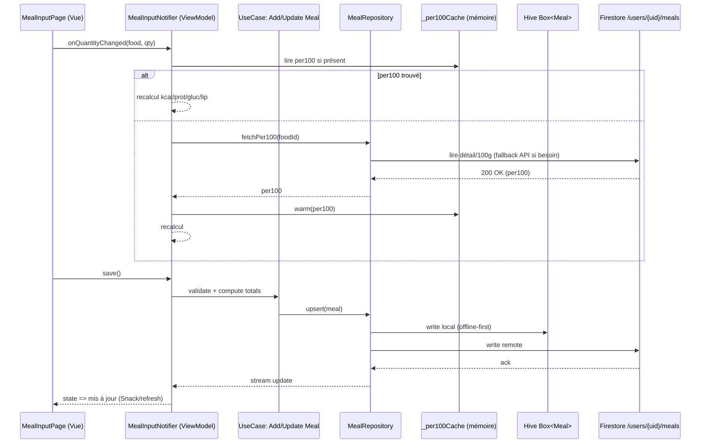
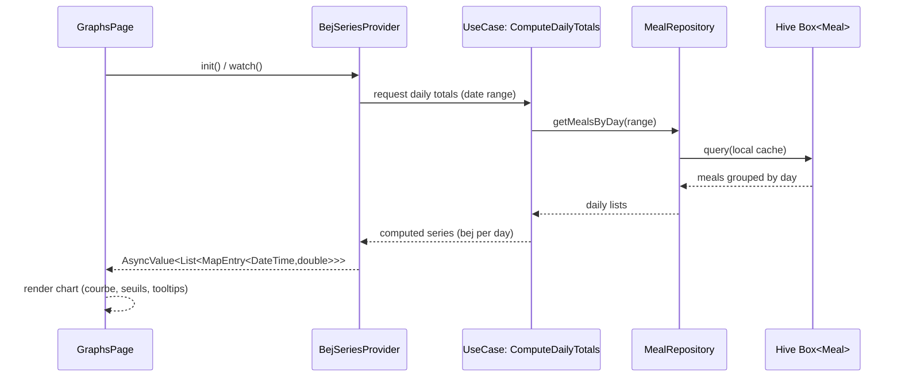
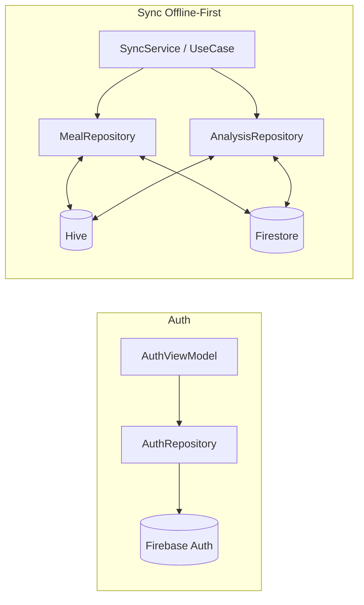
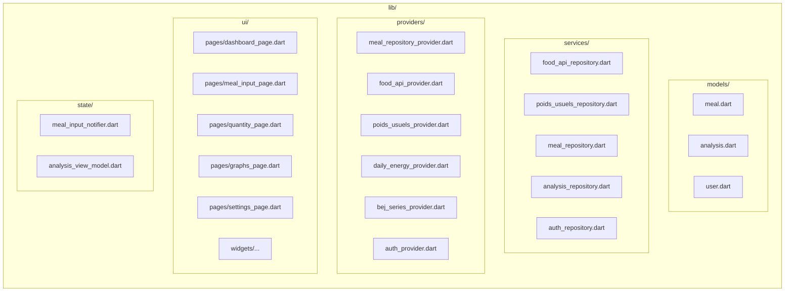

# nutriApp — Schéma MVVM (Flutter + Riverpod + Hive + Firestore)

> Document prêt à prévisualiser avec **Markdown Preview Mermaid Support** dans VS Code.  
> Ouvre ce fichier puis `Cmd/Ctrl + K, V` (Open Preview to the Side).

---

<h2 class="text-2xl font-bold">1) Vue d’ensemble — Couches MVVM</h2>

```mermaid
flowchart LR
    %% === VUE ===
    subgraph UI[Couche Vue (Widgets Flutter)]
      UI_Dashboard[DashboardPage]
      UI_MealInput[MealInputPage]
      UI_Quantity[QuantityPage]
      UI_Graphs[GraphsPage]
      UI_Settings[Settings/Profile]
    end

    %% === VIEWMODEL ===
    subgraph VM[Couche ViewModel (Riverpod / StateNotifier / Notifiers)]
      VM_MealInput[MealInputNotifier]
      VM_DailyEnergy[DailyEnergyProvider]
      VM_BEJ[BejSeriesProvider]
      VM_Analysis[AnalysisViewModel]
      VM_Auth[AuthViewModel]
    end

    %% === DOMAINE ===
    subgraph DOMAIN[Couche Domaine (UseCases / Services Métier)]
      UC_AddMeal[UseCase: AddMeal]
      UC_UpdateQty[UseCase: UpdateQuantity]
      UC_DailyTotals[UseCase: ComputeDailyTotals]
      UC_LipidsRatio[UseCase: ComputeLipidsRatio (MUFA+PUFA)/SFA]
      UC_Sync[UseCase: SyncOfflineFirst]
    end

    %% === DONNÉES ===
    subgraph DATA[Couche Données (Repositories)]
      R_Meal[MealRepository]
      R_FoodAPI[FoodAPIRepository]
      R_Poids[PoidsUsuelsRepository]
      R_Analysis[AnalysisRepository]
      R_Auth[AuthRepository]
    end

    %% === SOURCES ===
    subgraph SRC[Sources de données]
      S_Hive[(Hive\nBox<Meal>, Box<Analysis>)]
      S_FS[(Firestore\n/users/{uid}/meals ...)]
      S_SP[(SharedPreferences)]
      S_HTTP[(HTTP APIs\nOpenFoodFacts, etc.)]
      S_Strava[(Strava/Garmin events)]
    end

    %% Flux principal
    UI_Dashboard --> VM_DailyEnergy
    UI_MealInput --> VM_MealInput
    UI_Quantity --> VM_MealInput
    UI_Graphs --> VM_BEJ
    UI_Settings --> VM_Auth

    VM_MealInput --> UC_AddMeal
    VM_MealInput --> UC_UpdateQty
    VM_DailyEnergy --> UC_DailyTotals
    VM_BEJ --> UC_DailyTotals
    VM_Analysis --> UC_LipidsRatio
    VM_DailyEnergy --> UC_Sync
    VM_BEJ --> UC_Sync

    UC_AddMeal --> R_Meal
    UC_UpdateQty --> R_Meal
    UC_DailyTotals --> R_Meal
    UC_LipidsRatio --> R_Analysis
    UC_Sync --> R_Meal
    UC_Sync --> R_Analysis
    UC_Sync --> R_Auth

    R_Meal <--> S_Hive
    R_Meal <--> S_FS
    R_FoodAPI <--> S_HTTP
    R_Poids <--> S_FS
    R_Analysis <--> S_Hive
    VM_DailyEnergy --> S_SP
    VM_BEJ --> S_Hive
```

---

<h2 class="text-2xl font-bold">2) Séquence — Ajout / Mise à jour d’un aliment avec cache “/100 g”</h2>



---

<h2 class="text-2xl font-bold">3) Séquence — Calcul BEJ & séries de graphiques</h2>



---

<h2 class="text-2xl font-bold">4) Dépendances Riverpod — Providers & Widgets</h2>

```mermaid
flowchart TD
  SP[sharedPreferencesProvider] --> P_Daily[DailyEnergyProvider]
  MBP[mealBoxProvider (Hive)] --> PR_Meal[mealRepositoryProvider]
  ABP[analysisBoxProvider (Hive)] --> PR_Analysis[analysisRepositoryProvider]

  PR_Meal --> VM_MealInput[MealInputNotifier]
  PR_Meal --> P_Daily
  PR_Analysis --> P_BEJ[bejSeriesProvider]
  P_Food[foodApiRepositoryProvider] --> VM_MealInput
  P_Poids[poidsUsuelsRepositoryProvider] --> VM_MealInput

  VM_MealInput --> UI_MealInput[MealInputPage]
  P_Daily --> UI_Dashboard[DashboardPage]
  P_BEJ --> UI_Graphs[GraphsPage]
```

---

<h2 class="text-2xl font-bold">5) Flux Auth & Sync (optionnel)</h2>



---

<h2 class="text-2xl font-bold">6) Carte des packages (à adapter)</h2>

> Placeholders à ajuster avec la structure réelle de `lib/`. Si tu me fournis un ZIP, je peux lier chaque noeud aux fichiers exacts.



---

## Notes & conventions (pour t’aider à garder la structure propre)

- **Séparer clairement** UI (widgets), ViewModel (StateNotifier/Providers), Domaine (use cases) et Données (repos).
- **Providers** : expose uniquement des flux/états “consommables” par l’UI. Évite d’appeler Firestore directement depuis l’UI.
- **Repositories** : responsable des *sources* (Hive, Firestore, HTTP). Gèrent le cache, les mappings, et l’offline-first.
- **Use Cases** : encapsulent la logique métier (validation, calculs, règles), testables indépendamment.
- **Sync** : un service/UseCase dédié peut piloter la synchro bidirectionnelle (Hive ⇄ Firestore) avec stratégies de conflit.
- **Charts** : prépare les `AsyncValue<List<MapEntry<DateTime,double>>>` dans les providers, l’UI ne fait que les afficher.

---

### Comment prévisualiser
1. Copie ce fichier en `schema_mvvm_full.md` dans ton projet.
2. Ouvre-le dans VS Code → **Open Preview to the Side**.
3. Assure-toi d’utiliser **Markdown Preview Mermaid Support**.

---

> Besoin que je **branche chaque noeud aux fichiers réels** (avec chemins exacts et relations concrètes) ?  
> Envoie un **ZIP** de ton projet (au lieu de `.7z`) et je te sors la version 100 % fidèle, prête à reviewer avec ton équipe.
