# nutriApp — Cartographie des fichiers par couche (réelle)

```mermaid
flowchart LR
    subgraph UI[Couche Vue — Pages/Widgets]
      N1_7767976[BejTrendsPage\nlib/courbe/bej_trends_page.dart]
      N2_9779128[LegalNoticePage\nlib/pages/legal_notice_page.dart]
      N3_3525008[LoginPage\nlib/pages/login_page.dart]
      N4_605355[MealSummaryPage\nlib/pages/meal_summary_page.dart]
      N5_3007251[OnboardingPage\nlib/pages/onboarding_page.dart]
      N6_1414072[ProfileFormPage\nlib/pages/profile_form_page.dart]
      N7_9243260[RegisterPage\nlib/pages/register_page.dart]
      N8_9817185[SplashScreen\nlib/pages/splash_screen.dart]
      N9_9271333[TrainingPlannerPage\nlib/pages/training_planner_page.dart]
      N10_2546178[WelcomePage\nlib/pages/welcome_page.dart]
      N11_1653831[UsualUnit\nlib/widget/quantity_page.dart]
    end

    subgraph VM[Couche ViewModel — Notifiers/Providers]
      N1_6991385[DashboardNotifier\nlib/dashboard/dashboard_notifier.dart]
      N2_4014976[_Per100\nlib/meal_input/meal_input_notifier.dart]
      N3_5419497[ProfileFormNotifier\nlib/profile_form/profile_form_notifier.dart]
      N4_3347730[TrainingPlannerNotifier\nlib/training_planner/training_planner_notifier.dart]
      N1_5872785[MainApplication\nlib/main.dart]
      N2_3858193[ProviderInjector\nlib/core/providers.dart]
      N3_1292771[DailyEnergy\nlib/courbe/bej_providers.dart]
      N4_8796231[MacroPctPoint\nlib/courbe/macro_providers.dart]
      N5_4447005[lib/courbe/sat_providers.dart]
      N6_5007718[DashboardPage\nlib/dashboard/dashboard_page.dart]
      N7_4891758[LoginNotifier\nlib/login/login_notifier.dart]
      N8_7688010[MealInputPage\nlib/meal_input/meal_input_page.dart]
      N9_8709683[lib/providers/common_providers.dart]
      N10_3305018[RegisterNotifier\nlib/register/register_notifier.dart]
      N11_3870806[FoodAPIRepository\nlib/repositories/food_api_repository.dart]
      N12_8926649[MealRepository\nlib/repositories/meal_repository.dart]
      N13_3719386[StravaRepository\nlib/repositories/strava_repository.dart]
      N14_884618[TrainingRepository\nlib/repositories/training_repository.dart]
      N15_2962619[UserProfile\nlib/repositories/user_repository.dart]
      N16_2957394[lib/services/ai_providers.dart]
    end

    subgraph DATA[Couche Données — Repositories]
      N1_9147102[PoidsUsuelsRepository\nlib/repositories/enrichir_poids_usuel.dart]
    end

    subgraph MODEL[Couche Modèles]
      N1_3811130[AlimentUsuel\nlib/models/aliment_usuel.dart]
      N2_1732104[Analysis\nlib/models/analysis.dart]
      N3_2735058[AnalysisAdapter\nlib/models/analysis.g.dart]
      N4_4870933[AppUser\nlib/models/app_user.dart]
      N5_1845195[CustomFood\nlib/models/custom_food.dart]
      N6_8453073[DailyCalories\nlib/models/daily_calories.dart]
      N7_7434389[Meal\nlib/models/meal.dart]
      N8_680397[MealAdapter\nlib/models/meal.g.dart]
      N9_7098749[ProposedIngredient\nlib/models/proposed_ingredient.dart]
    end
```


## Détails JSON
```json
{
  "providers": [
    {
      "path": "lib/main.dart",
      "classes": [
        "MainApplication"
      ],
      "flags": {
        "notifier": false,
        "repository": false,
        "provider": true,
        "page": false,
        "model": false
      }
    },
    {
      "path": "lib/core/providers.dart",
      "classes": [
        "ProviderInjector"
      ],
      "flags": {
        "notifier": false,
        "repository": false,
        "provider": true,
        "page": false,
        "model": false
      }
    },
    {
      "path": "lib/courbe/bej_providers.dart",
      "classes": [
        "DailyEnergy"
      ],
      "flags": {
        "notifier": false,
        "repository": false,
        "provider": true,
        "page": false,
        "model": false
      }
    },
    {
      "path": "lib/courbe/macro_providers.dart",
      "classes": [
        "MacroPctPoint"
      ],
      "flags": {
        "notifier": false,
        "repository": false,
        "provider": true,
        "page": false,
        "model": false
      }
    },
    {
      "path": "lib/courbe/sat_providers.dart",
      "classes": [],
      "flags": {
        "notifier": false,
        "repository": false,
        "provider": true,
        "page": false,
        "model": false
      }
    },
    {
      "path": "lib/dashboard/dashboard_page.dart",
      "classes": [
        "DashboardPage",
        "_WeekSelector",
        "_CalorieSummaryDetailed",
        "_MacroDetailsDetailed",
        "_MacroBreakdownBar",
        "_AiAnalysisCard",
        "_MealCalorieBreakdown",
        "_StravaActivitiesList"
      ],
      "flags": {
        "notifier": false,
        "repository": false,
        "provider": true,
        "page": true,
        "model": false
      }
    },
    {
      "path": "lib/login/login_notifier.dart",
      "classes": [
        "LoginNotifier"
      ],
      "flags": {
        "notifier": true,
        "repository": false,
        "provider": true,
        "page": false,
        "model": false
      }
    },
    {
      "path": "lib/meal_input/meal_input_page.dart",
      "classes": [
        "MealInputPage",
        "_RoundIconButton",
        "_MealInputPageState"
      ],
      "flags": {
        "notifier": false,
        "repository": false,
        "provider": true,
        "page": true,
        "model": false
      }
    },
    {
      "path": "lib/providers/common_providers.dart",
      "classes": [],
      "flags": {
        "notifier": false,
        "repository": false,
        "provider": true,
        "page": false,
        "model": false
      }
    },
    {
      "path": "lib/register/register_notifier.dart",
      "classes": [
        "RegisterNotifier"
      ],
      "flags": {
        "notifier": true,
        "repository": false,
        "provider": true,
        "page": false,
        "model": false
      }
    },
    {
      "path": "lib/repositories/food_api_repository.dart",
      "classes": [
        "FoodAPIRepository"
      ],
      "flags": {
        "notifier": false,
        "repository": true,
        "provider": true,
        "page": false,
        "model": false
      }
    },
    {
      "path": "lib/repositories/meal_repository.dart",
      "classes": [
        "MealRepository"
      ],
      "flags": {
        "notifier": false,
        "repository": true,
        "provider": true,
        "page": false,
        "model": false
      }
    },
    {
      "path": "lib/repositories/strava_repository.dart",
      "classes": [
        "StravaRepository"
      ],
      "flags": {
        "notifier": false,
        "repository": true,
        "provider": true,
        "page": false,
        "model": false
      }
    },
    {
      "path": "lib/repositories/training_repository.dart",
      "classes": [
        "TrainingRepository"
      ],
      "flags": {
        "notifier": false,
        "repository": true,
        "provider": true,
        "page": false,
        "model": false
      }
    },
    {
      "path": "lib/repositories/user_repository.dart",
      "classes": [
        "UserProfile",
        "UserRepository"
      ],
      "flags": {
        "notifier": false,
        "repository": true,
        "provider": true,
        "page": false,
        "model": false
      }
    },
    {
      "path": "lib/services/ai_providers.dart",
      "classes": [],
      "flags": {
        "notifier": false,
        "repository": false,
        "provider": true,
        "page": false,
        "model": false
      }
    }
  ],
  "repositories": [
    {
      "path": "lib/repositories/enrichir_poids_usuel.dart",
      "classes": [
        "PoidsUsuelsRepository"
      ],
      "flags": {
        "notifier": false,
        "repository": true,
        "provider": false,
        "page": false,
        "model": false
      }
    }
  ],
  "notifiers": [
    {
      "path": "lib/dashboard/dashboard_notifier.dart",
      "classes": [
        "DashboardNotifier"
      ],
      "flags": {
        "notifier": true,
        "repository": false,
        "provider": false,
        "page": false,
        "model": false
      }
    },
    {
      "path": "lib/meal_input/meal_input_notifier.dart",
      "classes": [
        "_Per100",
        "MealInputNotifier"
      ],
      "flags": {
        "notifier": true,
        "repository": false,
        "provider": false,
        "page": false,
        "model": false
      }
    },
    {
      "path": "lib/profile_form/profile_form_notifier.dart",
      "classes": [
        "ProfileFormNotifier"
      ],
      "flags": {
        "notifier": true,
        "repository": false,
        "provider": false,
        "page": false,
        "model": false
      }
    },
    {
      "path": "lib/training_planner/training_planner_notifier.dart",
      "classes": [
        "TrainingPlannerNotifier"
      ],
      "flags": {
        "notifier": true,
        "repository": false,
        "provider": false,
        "page": false,
        "model": false
      }
    }
  ],
  "pages": [
    {
      "path": "lib/courbe/bej_trends_page.dart",
      "classes": [
        "BejTrendsPage"
      ],
      "flags": {
        "notifier": false,
        "repository": false,
        "provider": false,
        "page": true,
        "model": false
      }
    },
    {
      "path": "lib/pages/legal_notice_page.dart",
      "classes": [
        "LegalNoticePage"
      ],
      "flags": {
        "notifier": false,
        "repository": false,
        "provider": false,
        "page": true,
        "model": false
      }
    },
    {
      "path": "lib/pages/login_page.dart",
      "classes": [
        "LoginPage",
        "_LoginPageState"
      ],
      "flags": {
        "notifier": false,
        "repository": false,
        "provider": false,
        "page": true,
        "model": false
      }
    },
    {
      "path": "lib/pages/meal_summary_page.dart",
      "classes": [
        "MealSummaryPage"
      ],
      "flags": {
        "notifier": false,
        "repository": false,
        "provider": false,
        "page": true,
        "model": false
      }
    },
    {
      "path": "lib/pages/onboarding_page.dart",
      "classes": [
        "OnboardingPage",
        "_OnboardingPageState",
        "_OnboardingSlideCard",
        "_Dots",
        "_Slide"
      ],
      "flags": {
        "notifier": false,
        "repository": false,
        "provider": false,
        "page": true,
        "model": false
      }
    },
    {
      "path": "lib/pages/profile_form_page.dart",
      "classes": [
        "ProfileFormPage",
        "_ProfileFormPageState",
        "_StravaConnectSection"
      ],
      "flags": {
        "notifier": false,
        "repository": false,
        "provider": false,
        "page": true,
        "model": false
      }
    },
    {
      "path": "lib/pages/register_page.dart",
      "classes": [
        "RegisterPage",
        "_RegisterPageState"
      ],
      "flags": {
        "notifier": false,
        "repository": false,
        "provider": false,
        "page": true,
        "model": false
      }
    },
    {
      "path": "lib/pages/splash_screen.dart",
      "classes": [
        "SplashScreen",
        "SplashScreenState"
      ],
      "flags": {
        "notifier": false,
        "repository": false,
        "provider": false,
        "page": true,
        "model": false
      }
    },
    {
      "path": "lib/pages/training_planner_page.dart",
      "classes": [
        "TrainingPlannerPage",
        "_GarminEventsForDay"
      ],
      "flags": {
        "notifier": false,
        "repository": false,
        "provider": false,
        "page": true,
        "model": false
      }
    },
    {
      "path": "lib/pages/welcome_page.dart",
      "classes": [
        "WelcomePage"
      ],
      "flags": {
        "notifier": false,
        "repository": false,
        "provider": false,
        "page": true,
        "model": false
      }
    },
    {
      "path": "lib/widget/quantity_page.dart",
      "classes": [
        "UsualUnit",
        "QuantityPage",
        "_QuantityPageState",
        "_MiniBtn"
      ],
      "flags": {
        "notifier": false,
        "repository": false,
        "provider": false,
        "page": true,
        "model": false
      }
    }
  ],
  "models": [
    {
      "path": "lib/models/aliment_usuel.dart",
      "classes": [
        "AlimentUsuel"
      ],
      "flags": {
        "notifier": false,
        "repository": false,
        "provider": false,
        "page": false,
        "model": true
      }
    },
    {
      "path": "lib/models/analysis.dart",
      "classes": [
        "Analysis"
      ],
      "flags": {
        "notifier": false,
        "repository": false,
        "provider": false,
        "page": false,
        "model": true
      }
    },
    {
      "path": "lib/models/analysis.g.dart",
      "classes": [
        "AnalysisAdapter"
      ],
      "flags": {
        "notifier": false,
        "repository": false,
        "provider": false,
        "page": false,
        "model": true
      }
    },
    {
      "path": "lib/models/app_user.dart",
      "classes": [
        "AppUser"
      ],
      "flags": {
        "notifier": false,
        "repository": false,
        "provider": false,
        "page": false,
        "model": true
      }
    },
    {
      "path": "lib/models/custom_food.dart",
      "classes": [
        "CustomFood"
      ],
      "flags": {
        "notifier": false,
        "repository": false,
        "provider": false,
        "page": false,
        "model": true
      }
    },
    {
      "path": "lib/models/daily_calories.dart",
      "classes": [
        "DailyCalories"
      ],
      "flags": {
        "notifier": false,
        "repository": false,
        "provider": false,
        "page": false,
        "model": true
      }
    },
    {
      "path": "lib/models/meal.dart",
      "classes": [
        "Meal"
      ],
      "flags": {
        "notifier": false,
        "repository": false,
        "provider": false,
        "page": false,
        "model": true
      }
    },
    {
      "path": "lib/models/meal.g.dart",
      "classes": [
        "MealAdapter"
      ],
      "flags": {
        "notifier": false,
        "repository": false,
        "provider": false,
        "page": false,
        "model": true
      }
    },
    {
      "path": "lib/models/proposed_ingredient.dart",
      "classes": [
        "ProposedIngredient"
      ],
      "flags": {
        "notifier": false,
        "repository": false,
        "provider": false,
        "page": false,
        "model": true
      }
    }
  ]
}
```